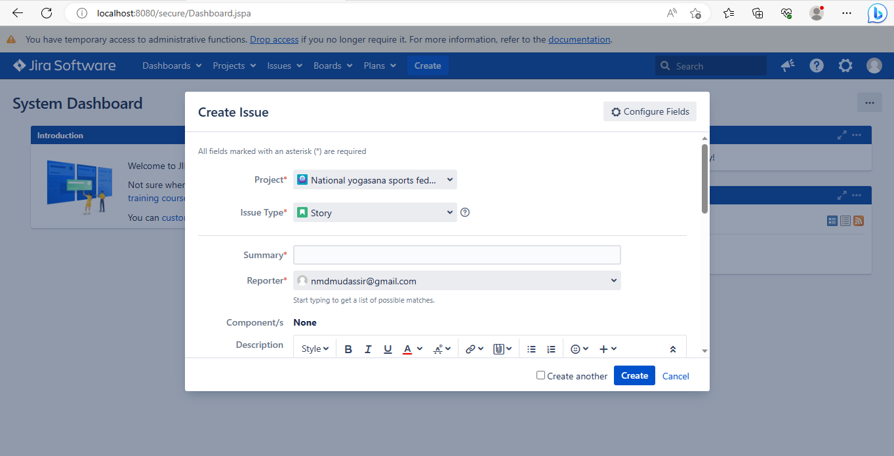
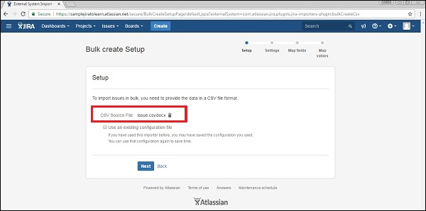

# JIRA

JIRA is a software testing tool developed by the Australian Company Atlassian. It is a bug tracking tool that 

reports all the issues related to your software or mobile apps. The word JIRA comes from the Japanese word, 

i.e., "Gojira" which means Godzilla.

JIRA is one of the most widely used open source testing tool used in manual testing.

<!--style="font-size:30px"-->
*  What is JIRA?

JIRA is a project management tool used for issues and bugs tracking system. It is widely used as an 

issue-tracking tool for all types of testing. This tutorial introduces the readers to the fundamental 

features, usage, and advantages of JIRA. This tutorial will guide the users on how to utilize this tool to 

track and report bugs in different applications.

<!--style="font-size:30px"-->
* The following are the useful aspects provided by the Jira:

1. Projects: It is used to manage the defects very effectively.

2. Issue: It is used to track and manage the defects/issues.

3. Workflow: Processes the Issue/Defect life cycle. Suppose we have a business requirement, we create the  

   technical design and from the technical design, we create the test cases. After creating the test cases, 

   coding is done, and then testing is performed on the project. This design workflow is possible by using 
   
   Jira.

4. Search: Find with ease. Suppose we have done with a project at the beginning of the December and its 

   version is 1.0. Now, we move to version 1.1 and completed at the end of December. What we are doing is that 
   
   we are adding new versions. Through Jira, we can get to know that what happened in the earlier versions, 
   
   how many defects occurred in the earlier projects and the learning we achieve from the earlier projects.

5. Dashboards: Dashboard is a display which you see when you log in to the Jira. You can create multiple 

   dashboards for multiple projects. You can create the personal dashboard and can add the gadgets in a 
   
   dashboard so that you can keep track of the assignments and issues that you are working on.

### Important Points to Note

The following points explain some interesting details of JIRA.

1. JIRA is an incident management tool.

2. JIRA is developed by Atlassian Inc., an Australian Company.

3. JIRA is a platform independent tool; it can be used with any OS.

4. JIRA is multi-lingual tool − English, French, German, Japanese, Spanish, etc.

5. JIRA supports MySQL, Oracle, PostgreSQL and SQL server in the backend.

6. JIRA can be integrated with many other tools − Subversion, GIT, Clearcase, Team Foundation Software, 

   Mercury, Concurrent Version System and many more.

### License and Free Trial

The following points describes the legalities of the JIRA Tool.

1. JIRA is a commercial tool and available as a Trial version for a limited time.

2. To utilize JIRA services, a license is required.

3. JIRA provides free license for academic projects.

4. A 15-day trial version is available for an individual person to use.

### Use of JIRA

Following are some of the most significant uses of JIRA.

1. JIRA is used in Bugs, Issues and Change Request Tracking.

2. JIRA can be used in Help desk, Support and Customer Services to create tickets and track the resolution and 

   status of the created tickets.

3. JIRA is useful in Project Management, Task Tracking and Requirement Management.

4. JIRA is very useful in Workflow and Process management.

### JIRA-Features

<!--style="font-size:20px"-->
1. Boards:

* These boards provide an immediate snapshot of the project to the team.

* Helps to quickly review the progress of the project and see the status of the individual tasks.

* Board workflow can be customized to fulfil the way a team wants to proceed.

<!--style="font-size:20px"-->
2. Business Project Template

* JIRA supports n number of business templates to manage simple tasks and complex tasks like workflow.

* Template can be customized based on the team and their approach. Ex: Workflow can be customized based on 

each team's approach.

* Every step is accounted and team can move to achieve their goals.

<!--style="font-size:20px"-->
3. Task Details

* Tasks can be defined at the individual level to track the progress.

* Status of every task, comment, attachment and due dates are stored in one place.

<!--style="font-size:20px"-->
4. Notifications

* An email can be sent for a particular task to the users.

* Voting and watching features to keep an eye on the progress for the stakeholders.

* Use @mention to get the attention of a specific team member at Comments/Description.

* User will instantly notify if something is assigned or if any feedback is required.

<!--style="font-size:20px"-->
5. Power Search

* JIRA supports a powerful search functionality with Basic, Quick and Advanced features.

* Use the search tool to find answers like due date, when a task was last updated, what items a team member 

still needs to finish.

* Project information at one place, search within a project.

<!--style="font-size:20px"-->
6. Reports

* JIRA supports more than a dozen reports to track progress over a specific timeframe, deadlines, individual’s 

contribution, etc.

* Easy to understand and generate different reports those help to analyze how the team is going on.

* Easy to configure these reports and display the matrices to the stakeholders.

<!--style="font-size:20px"-->
7. Scale with Team Growth

* JIRA supports any business team and any project irrespective of size and complexity.

<!--style="font-size:20px"-->
8. Add -Ins

* JIRA supports more than 100 add-ins to connect with different software to make work easy.

* Wide range of add-ins makes it as universal across the globe.

<!--style="font-size:20px"-->
9. Multilingual

* JIRA supports more than 10 languages those are widely used as English (US, UK, India), French, German, 

Portuguese, Spanish, Korean, Japanese and Russian.

<!--style="font-size:20px"-->
10. Mobile App

* JIRA is available as a Mobile Application as well.

* It is available on Google Play Store and App Store (iTunes) of Apple.

* Easy to stay connected with the team while moving anywhere with notification, comments and project activity.

### Why JIRA?

<!--style="font-size:30px"-->
*   Plan, Track and Work Faster

JIRA is a bug-tracking tool mainly used to track, organize, and prioritize the bugs, newly added features, 

improvements for certain software releases. Projects are subdivided into issues and issues can be of multiple 

types such as bug, new feature, improvement, and documentation tasks.

When the release date of software comes near, then software developers need to focus on the remaining issues 

which are to be fixed before the specified date. It also becomes difficult for the QA to maintain the status 

of the documentation, i.e., sometimes it becomes hard to keep track of everything.

JIRA is a good choice for handling the above issues. It enables software developers to track issues and 

improvements. It manages the projects as well as maintain the technical documentation.

<!--style="font-size:30px"-->
*  The main source of information

JIRA is the primary source of information for the next software release. On JIRA, the whole team of the 

software developers can plan for the new features which are to be added and bugs to be fixed in the next 

release.

It also helps the QA team in writing the technical documentation. Through JIRA, the QA team can check the 

status of each feature that is newly added by the software developers, and according to that, they can plan 

how to document for the new version.

<!--style="font-size:30px"-->
*  Organize the documentation tasks

JIRA tool is used to organize the documentation tasks. It is useful in grouping the multiple tasks by using 

the component functionality, and even you can create your own documentation. In this way, you can create a 

structured way of documentation.

<!--style="font-size:30px"-->
*  Track the progress of our documentation

It is a very useful tool in tracking the progress of our documentation. JIRA tool provides a very important 

feature, i.e., pie chart macro. In the pie chart macro, you can view tasks such as Open tasks, Closed tasks, 

Resolved tasks.

<!--style="font-size:30px"-->
*  Helps to meet the deadlines of a documentation release.

You can define the specific due date or deadline for the release of documentation, and even you can configure 

the JIRA tool with the notifications so that you can finish your documentation in time.

<!--style="font-size:30px"-->
*  Measures the time spent on documentation

JIRA tool does not have the default functionality for measuring the time spent on documentation. JIRA tool is 

bundled with the Tempo Timesheets, which measures how much time has been spent on the documentation.

<!--style="font-size:30px"-->
*  Provides feedback faster

JIRA tool provides the Confluence pages where you can connect to the issues in just a few clicks. If something 

needs to be updated, then you can create the issues directly from the Confluence page.

# JIRA-INSTALLATION

In this chapter, we will learn how to install JIRA on your system.

<!--style="font-size:30px"-->
Important Points to Note

* JIRA is a web application that provides a private website to an individual or a set of requested users 

belonging to the same company/project.

* JIRA can be run as a Windows Service at the server side.

* JIRA is a pure Java based application and supports all OS platforms like Windows, Linux of different 

  versions or MAC, etc., those satisfy JDK/JRE requirements.

* JIRA supports all famous browsers like Chrome, IE, Mozilla and Safari.

* It supports Mobile browsers as well in mobile views.

<!--style="font-size:30px"-->
System Requirements

Since JIRA is a web-application, it follows the concept of client/server. It means that JIRA can be installed 

centrally on a server and users can interact with it through web-browsers using a website from any computer.

* Browser − JavaScript should be enabled, the user is recommended not to use any script-blocking tool like    

  NoScript to access full functionality of JIRA.

* JDK/JRE − It is recommended to update JRE/JDK with the latest version. JIRA 6.4 recommends using JRE/JDK 

  version 8.

Since our scope is to consume the JIRA application as end users, we can ignore the server side requirements.

<!--style="font-size:30px"-->
Installation at the Server Side

* JIRA follows the Client/Server concept. At the server side, JIRA must be installed before using it as end 

  user.

* At the server side, JIRA must connect with relation database to store issues/application data.

* Download the JIRA Windows Installer.exe file from the following link − https://www.atlassian.com/software/

  jira/download?_ga=1.28526460.1787473978.1 488778536.

* Select the OS type and click on Download.

The following screenshot shows how to download the .exe file for a specific OS.

Run the .exe file to run the installation wizard. The following screenshot shows the downloaded .exe file.

After clicking the .exe file, the Run confirmation pop-up displays, click on RUN. The following screenshot 

shows the RUN confirmation pop-up.

The following JIRA installation wizard displays, click on Next.

Choose the appropriate installation option as shown in following screenshot and then click on Next.

The installation summary is displayed with the Destination Directory, Home Directory, TCP Ports, etc., as 

shown in the following screenshot.

Click on Install. JIRA will start installing as displayed in following screenshot. It takes a couple of 

minutes to finish the installation.

After installation, JIRA will be started automatically if the check box to “Start JIRA Software 7.3.4 now” is 

checked. Then click on Next, if not, it can be accessed using the appropriate Windows Start Menu shortcut.

Click the Finish button.

The installer will create the following shortcuts on the start menu −

* Access JIRA
* Start JIRA Server
* Stop JIRA server
* Uninstall JIRA

The following screenshot shows the above-mentioned shortcuts −

Select the license type and enter organization name as shown in following screenshot −

Click on Generate License

A confirmation pop-up will display as shown in the following screenshot. Click on Yes.

Set up the administration account as displayed in the following screenshot.

JIRA will automatically finish the setting-up as shown below −

Once JIRA finishes the setup and starts running in the server, the user can access it from a browser on any 

computer with network access to the JIRA server.

# JIRA-Free Trials Setup

JIRA provides 15 days to 1-month free trials of basic features. JIRA has other plans as well with different 

advanced features and add-ins. The cost depends on the number of users.

By visiting https://www.atlassian.com/software/jira/try, a user can see different available plans for trying 

purposes.

<!--style="font-size:30px"-->
Setup for Free Trials

To setup a free trial, the user has to Sign up on the following link − https://id.atlassian.com/signup?

application=&tenant=&continue or login if he already has an account.

The following screenshot shows required fields to sign up in Atlassian account.

The user has to log into the email account and verifies the account by clicking on the link sent by 

JIRA-Atlassian. The next step is to go to https://www.atlassian.com/software/jira/try and click on Create now 

button, which is at the bottom right hand of the webpage.

The following screenshot shows different plans available for trial of JIRA.

The following screenshot shows the details of the chosen plan for a free trial.

Once the user fills in all the details along with the sample website name, user has to click on the Start now 

button. The following screenshot shows how to claim your site and provide your credentials to start it.

It will take a few minutes to start the requested sample JIRA website. Once it is done, the JIRA login page 

will display and the user can see the given sample website name in the browser’s address bar. The user can now 

directly access this link to navigate to JIRA. The following screenshot shows the login page of JIRA.

# JIRA-Login

To login to JIRA, go to your sample website. It will open a login page. Fill in your registered email address/

username and Password. Click on the Login button. The following screenshot shows how to login into JIRA using 

your credentials.

<!--style="font-size:30px"-->
Successful Login

On a successful login, the system dashboard will display if the account is associated with any project by the 

admin, or if a user can create a sample project as explained in the earlier chapters.

The following screenshot displays the welcome page/dashboard of JIRA on a successful login.

# JIRA-Dashboard

After logging into JIRA, the Dashboard is the first page that shows up. The Dashboard is customized by the 

Admin. Based on the roles, the admin can set the access of JIRA. Even the admin has the right to change colors 

and the logo of JIRA.

<!--style="font-size:30px"-->
Important Points of the Dashboard

Following are some of the most significant points the users should understand before using the JIRA Dashboard −

* The navigation bar, present at the top of the JIRA page, will be the same across all the pages/screens of 

JIRA. Dashboard, Projects, Issues, Boards and Create are the main links. These links have many sub-links to 

navigate other functionalities.

* Navigation bar contains links that provides a quick access to the most useful functions of JIRA.

* Just under navigation bar, there is a System Dashboard.

* The information provided in the system dashboard area can be customized by the Admin.

* By default, it has three main sections – Introduction, Assigned to Me (displays Issues list assigned to 

users) and Activity Stream (Activities done by the users).

The following screenshot shows the overview of the Dashboard page of JIRA −

<!--style="font-size:30px-->
Types of Projects

The Projects link has several sub-links, which are explained in detail for better understanding −

* Current Project − It displays the name of the Project where the user is currently in or is viewing the 

dashboard of the project. By clicking at Project name, it will display the list of issues associated with the 

project.

* Recent Project − It displays the name of the recent project that the user has accessed, if exists, where the 

user can navigate by clicking on the project listed under this header.

* Software − It is the sub-link to navigate the list of projects, which are listed in the Project Type as 

Software.

* Business − It is also a project-type. By clicking here, it will display the list of business project types.

* View all Projects − It displays all the projects, which are associated with the logged in user.

* Create Project − This link is usually accessed by the Admin or it depends on various roles. If this link is 

visible, a user can create a new project by following the instructions given there.

The following screenshot shows the different sub-links under the Project category.

<!--style="font-size:30px"-->
Types of Issues

It has many sub links to access other functionalities. The following screenshot shows different available 

sub-links under Issue navigation.

* Search for Issues − It navigates to the search page, where the user can provide search criteria to narrow 

down the results.

* Recent Issues − It displays the list of issues that are recently viewed by the user.

* Import issue from CSV − This feature allows the user to import the details of issues by uploading a CSV file 

and mapping the fields.

* My open issues − It is the filter section, which displays issues those are open and assigned to the 

logged-in user.

* Reported by me − This filter section displays the issues, which are already created by the logged-in user.

* Manage filters − It helps to customize the filter and narrow down the results. It displays any saved 

filters/ favorites filters.

<!--style="font-size:30px"-->
Types of Boards

Boards are showcase of process that is followed by Project. It could be the most famous Agile Board if the 

project is following the agile methodology or it might be the Kanban board as well.

* Recent Board − It displays the recent project board accessed by the user.

* View all boards − It displays all available project boards.

The following screenshot shows the different sub-links available under the board section

<!--style="font-size:30px"-->
The Create Button

By clicking on the Create button, it displays the create form to log an issue.

The following screenshot shows required fields and other fields to create an issue −

<!--style="font-size:30px"-->
The Feedback Link

There is a feedback link at the right side of the navigation bar (as highlighted in the following screenshot). 

By clicking on link, user gets a form where he can provide feedback by entering Summary, Description, Name and 

email.

The following screenshot shows the location of the Feedback link present in the Dashboard.

The following screenshot shows the required and optional fields to provide feedback.

Once all the fields are filled, click on Submit, it successfully posts the feedback.

<!--style="font-size:30px"-->
The Help Link

The Help link provides different useful documentation about JIRA. It provides the details of JIRA as well by 

clicking on “About JIRA”. Similarly, this link also provides new release features by clicking on “What’s new”. 

Keyboard shortcuts have much useful keyboard navigation for users that saves time. The following screenshot 

shows the Help link and different sub-links available in it.

<!--style="font-size:30px"-->
User Profile Button

By clicking on the profile link, the user can view his profile details and manage this section. By clicking on 

Logout, the user will get back to the login page and will not be able to access the project details without 

logging in again.

The following screenshot shows available functionality under User-Profile section −

By clicking on the edit symbol, the user will be able to edit profile details like – Summary Details,

Preferences, etc. The following screenshot shows how to edit the profile by clicking on the Edit  icon at each 

section.

On the right side, the user can see the activity stream performed by the logged in user.

# JIRA-Issue Types

Since JIRA tracks all the tasks, the sub-tasks or even a work as an Issue, there are several types of Issues 

to identify the work and categorize the similar issues.

An Issue is classified as follows −

* Sub-Task − This is the sub-task of an issue. In a logged issue, there can be different tasks to resolve it, 

which are called as sub-tasks.

* Bug − A problem that impairs or prevents the functions of the product.

* Epic − A big user story that needs to be broken down. Created by JIRA Software - do not edit or delete.

* Improvement − An improvement or enhancement to an existing feature or task.

* New Feature − A new feature of the product, which is yet to be developed.

* Story − A user story. Created by JIRA Software - do not edit or delete.

* Task − A task that needs to be done to achieve team’s goal.

<!--style="font-size:20px"-->
Step to see the Issue Types-:

If a user logs in as Admin and navigate to Settings → JIRA Administrator → Issues, all the listed issue types 

will display. The following screenshot shows all the available issue types in JIRA.

<!--style="font-size:30px"-->
Issue Type Schemes

An issue type scheme determines which issue types will be available to a project or set of projects. It also 

manages specifying the order in which the issue types will present in the user interface of JIRA, while 

creating an Issue. An issue type scheme generates as soon as the project is added in the JIRA.

Here, one scheme is by default named as the Default Issue Type Scheme and others are project schemes. The 

default issue type scheme is the list of global issue types. All newly created issue types will automatically 

be added to this scheme. The following screenshot shows Issue type schemes of different projects.

By clicking on the Add Issue Type Scheme button at the top right hand corner, the user can add a user defined 

scheme.

Enter the Name, Description and Select the Issue Type for the Current scheme from the Available issue type 

list. The following screenshot shows how to add a new type schema by providing the required and optional 

fields.

Click on Save. The new schema will appear in the list. The Following screenshot shows how the page display 

after adding a new Issue Type schema −

By clicking on Edit, the user can edit the details. By clicking on Associate, the user can associate this 

scheme to a project. Copy and Delete is used for copying and deletion of the same scheme.

# JIRA-Issue Creation

To create an issue in JIRA, the user should have Create Issue permission in the project. Admin can add/remove 

the permission.

<!--style="font-size:30px"-->
Steps to Follow

Click on the Create button in the navigation bar to open the create issue dialogue box.

To complete the process of creating an issue, we should follow the pointers given below.

* Select the Project where the issue is.

* Select the type of issue, whether it is a bug/new feature/story, etc.

* Write a one-line summary to provide the overall idea about the issue.

* Write the details of the issue in the Description field. Explain the issue, so that stockholders can 

understand every detail of the issue.

* To create a similar type of issue in the same project and issue type, check the checkbox of “Create another” 

otherwise keep it as unchecked.

* After entering all the details, click on the Create button.

The following screenshot shows how to create an issue by providing the required and optional details.

If the “Create another” checkbox is not checked, after clicking on the Create button, the user will have to 

navigate to the Dashboard and a pop-up will display on the right side with an issue id and summary.

The following screenshot shows how to know whether the issue is successfully created or not.

<!--style="font-size:30px"-->
Configure Fields

To add other fields in the Create Issue form, click on “Configure fields” at the top right hand side of the 

page. The following screenshot shows how to configure the fields in the Create Issue page.

After clicking on the Configure fields button, a drop down box will be displayed, click on Custom. The 

following screenshot shows the available fields under the Custom tab.

By checking and unchecking the checkboxes to show and hide, fields will be added or cleared from the form. The 

following screenshot shows the available fields under the All tab.

Now navigate to Create Issue, all fields based on choices will be displayed in the form that shows up. The 

following screenshot shows the configured fields in the Create Issue page.

<!--style="font-size:30px"-->
The fields in the Create Issue form are explained below.

* Priority − Issue creator can set the priority to resolve the issue as High, Medium, Low, and Lowest.

* Labels − It is similar to Tag; it helps in filtering out specific types of issues.

* Linked Issue − It links other issues that are either dependent on this issue or this issue is dependent on 

them. Options in dropdowns are – block, is blocked by, duplicate, clone, etc.

* Issue − User can link the issue by the Typing ID or summary of those that are related to the linked issue 

field.

* Assignee − The person who is responsible to fix this issue. Assignee name can be entered by the issue 

creator.

* Epic Link − An Issue creator can provide an epic link, if the issue belongs to any of those.

* Sprint − The user can define in which sprint, this issue belongs to, when this issue should be addressed.

# JIRA-Create a Subtask

An issue can be completed by performing many tasks with different persons like Dev, QA, UAT, Business, 

Support, etc. To track the progress in each department, sub-tasks are created in an issue and assigned to the 

concern person. Once all the sub-tasks are resolved, the issue can be marked as completed.

<!--style="font-size:30px"-->
Points to Note for Creating a Subtask

The following points are to be considered when creating a subtask.

* All subtasks are an essential part of their parent issue.

* All subtasks are visible on the main screen of the parent issue.

* Subtasks always belong to the same project as their parent issue.

* Subtask has all fields that are present in the standard issue.

* Subtasks cannot have a subtask of their own.

<!--style="font-size:30px"-->
Steps to Follow for Creating a Subtask

We should consider the following steps when creating a subtask.

* step 1: GO to Side pain there Backlog Option will come click on that list of all backlog will display.

* step 2: click on the link then pop-up window will come.

* step 3: Window click on '...' then list of option will come in that click on create a subtask.

Enter the details in all the required fields and then click on Create. The following screenshot shows the 

Create Subtask Form with the required and optional fields.

Once a subtask is created, it will be available on the Main Issue page → Subtask section. The following 

screenshot shows how to view a subtask in an issue.

# JIRA-Create Issue Using CSV

A User can create multiple issues at a time using Comma separated file known as CSV. The CSV files are text 

files those represent tabulated data and separate different sections by commas.

They have two-step process that requires importing the data from a CSV, while a third optional step is also 

present, which are listed below.

1. Prepare a CSV file.
2. Import the CSV file into the system.
3. Save the configuration for future use.

<!--style="font-size:30px"-->
1. Prepare the CSV File

While creating a CSV file the following points must be considered.

Each CSV file should have a heading row with a summary column. The first row is the heading row and represents 

the fields of the create issue page. Example − Summary, Assignee, Reporter, Priority, Description, sprint, 

“Test Suite”, Ashish, Ashish, 1, etc.

* Use double quote marks (“) in the CSV file to capture data that appears in multip.le lines. For Example − 

upon import, JIRA will treat the following CSV as a single record: Summary, Description, Status, "Login 

issue", "This is on a new line", Open

* While importing issues from a CSV file, the Project Name and Project Key are important columns in CSV. In 

addition, the name of these fields should match exactly as they are present in JIRA.

<!--style="font-size:30px"-->
2. Import the CSV File

To import the CSV file, we should follow the steps given below.

Step 1 − Select Issues → Import Issues from CSV to open the Bulk Create Setup page.

The following screenshot shows how to access the Import issues from the CSV functionality.

Step 2 − On the Setup page, select CSV Source File. Do not check the “Use an existing configuration file” 

check box, if you do not have a configuration file or if you want to create a new configuration file.

Configuration files specify a mapping between column names in the CSV file's header row and fields in the JIRA 

application.

The following screenshot shows the Bulk create setup page, where the user browses and uploads the CSV file.

Step 3 − If the user checks the checkbox of “Use an existing configuration file”, JIRA will ask to specify an 

Existing Configuration File.

The following screenshot shows how to use an existing configuration file.

Step 4 − If the user does not select this option, then at the end of the CSV file import wizard, JIRA will ask 

to create a configuration file, which can be used for subsequent CSV imports.

Click on the Next button → the Settings step of the CSV file import wizard will display. Complete the required 

fields. If the CSV file uses a different separator character other than a comma, specify that character in the 

CSV Delimiter field. If the separator is a 'Tab', this can be entered using the format '/t'.

The following screenshot shows how to provide settings of csv file −

Step 5 − Click on the Next button to proceed to the Map field’s step of the CSV file import wizard. Here, the 

user has to map the column headers of the CSV file to the fields in the selected JIRA project. After 

selection, tick the check box for Map field value.

A CSV field should map to the JIRA summary field. This ensures the issues created have a summary.

The following screenshot shows how to map CSV fields with JIRA fields −

Step 6 − Click on the Next button, the Map values step of the CSV file import wizard will display. On this 

step of the import wizard, the user can select which specific CSV field values to map to which specific JIRA 

field value.

* Fields whose Map Field Value check boxes were selected in the previous step will be presented on this page.

* If the CSV field has a username (e.g. Reporter or Assignee) and does not select the Map Field Value check 

box for this field in the previous step of the CSV file import wizard, then the importer will map imported 

usernames from the CSV file to (lowercase) JIRA usernames.

The following screenshot shows how to map values.

Step 7 − Click on the Validate button, it will validate the imported data and display if any errors or 

warnings are required, otherwise it will display how many successful imports are possible with the file.

The following screenshot shows the successful validation of CSV file.

Step 8 − Now, Click the Begin Import button. The importer will display updates like import is in progress, 

then a success message when the import is completed.

Following screenshot shows how many issues are created using CSV file −

Step 9 − Click on the Check Created issues, it will display the list of issues those are created using the 

CSV.

The following screenshot shows the list of newly created issues using the CSV file.

# JIRA-Edit an Issue

To edit an issue in JIRA, the user has to navigate to the issue, which is required to edit and the click on 

the issue to open the page. The next step is to click on the Edit button, which is present at the top left 

hand side of the view issue page. It will open the edit issue page that is similar to the create page.

The following screenshot shows how to access the Edit functionality.

Modify the issue details in the corresponding field of the edit Issue page. The Following screenshot shows 

the edit page to update details of an issue.

Once the update is completed, click on the Update button. The user will be able to see the edited text/fields 

in the View Issue Page.

The Following screenshot shows the updated details −

# JIRA-Email an Issue

In this chapter, we will learn how to email an issue in JIRA. A user can email an issue to other JIRA users. 

There are two ways to do it −

* By share an issue and

* By mention these users in issue’s Description or Comment field.

Let us now discuss each of these in detail.

<!--style="font-size:30px"-->
Sharing an Issue

To begin with, the user should navigate to the issue that is required to share and click to view the issue. 

Click on the Share Symbol on the top right hand side of the page. The following screenshot shows where the 

sharing option present at issue page −

You can write the JIRA users’ name by typing their usernames or partially/all of their full names as 

registered with JIRA or type the email addresses of the individuals with whom you would like to share the 

issues.

When the user starts typing a JIRA user's username or name, or a previously specified email address, an 

auto-complete dropdown list of users appears.

The Following screenshot shows how to provide email addresses or select from the auto-completion suggestions.

Add optional note. Click on the Share button present in the Share wizard section. The following screenshot 

shows how to share/email an issue to a user.

<!--style="font-size:30px"-->
Mention Users in Description / Comment:

In the issue's Description or the Comment field, type '@' and then the first few characters of the JIRA 

user's username or partially/all of their full name as registered with JIRA.

As the user starts typing, a list of suggested users will appear in a dropdown list below the field. The user 

should select based on the referenced users by completely typing the JIRA user's username or choose from the 

list of suggested users in the dropdown list.

The following screenshot shows how to mention the user’s name/email in the description.

Click on submit the field. JIRA will send that user an email message indicating that you mentioned them on 

that issue.

The following screenshot shows how to submit mentioning the user’s email in the description.

# JIRA-Label an Issue

A Label is used to categorize an issue. It is similar to the hashtag (#) used in twitter, Facebook or other 

social sites. It also helps while searching an issue. While viewing an issue, the label appears in the detail 

section of the issue.

The following screenshot shows where the labels are present in the issue detail page.

Once the user clicks on the label i.e. WFT, it will display the list of issues having the same label.

The following screenshot shows how to search issues using label names −

<!--style="font-size:30px"-->
Add and Remove Labels

To add or remove labels, a user has to go to the View Issue page and select the issue that needs to add 

labels. Click on Label →  A dialogue box will appear.

Start typing the label and select from the suggestions. The following screenshot shows how to add labels.

The following screenshot shows how to access the Label features.

To ‘Delete’ a label, click on the close (x) sign, which appears beside the label name. The following 

screenshot shows how to delete an existing label −

# JIRA-Linking Issues

This feature is very useful when two issues have some type of a dependency on each other as if they are 

duplicates or relate to each other, upstream downstream dependency or blocking issues.

<!--style="font-size:30px"-->
Create a Link to Another Issue

For creating a link to another issue, the user has to navigate to the issue and click on the View Issue Page. 

After that, click More → Link to display link dialogue page.

The following screenshot shows how to access Link feature −

Select JIRA Issue item in the left side of the dialogue and select “This issue” field from the dropdown list. 

The following screenshot shows how to link an issue by providing the details.

The next step is to select/search issue. The following screenshot shows how to add an issue as a link in 

another issue.

Add the comment; it is optional and then Click on Link. The View Issue page shows up and the user can go down 

and verify whether the linked issue is displayed or not under the Section Issue links.

The following screenshot shows how to view linked issue in parent issue −

<!--style="font-size:30px"-->
Deleting a Link

To delete a link, a user should go to the View Issue page and to that issue which contains the links. Scroll 

down and go to Issue Links section. Hover the mouse over the link that should be deleted and then click on 

the Delete icon.

The following screenshot shows how to delete a link −

A confirmation pop-up will display; click on the Delete button. The following screenshot shows the 

confirmation pop-up for deletion.

# JIRA-View/Change History

In this chapter, we will learn how to view and change history in JIRAN. History is the record of all the 

activities performed on issues. Some of the most common instances are −

* Creator of the issue

* Changes to an issue field

* Attachment of a file

* Deletion of comment/Work log

* Addition/deletion of links

In a history record, a user can view the following information.

* User name who made the changes

* Time while the changes was made

* If an issue field is changed, new and old values of that field.

<!--style="font-size:30px"-->
Steps to View History

To view history in JIRA, the user should follow the steps given below.

* Go to View Issue Page to see change history

* Scroll down to Activity section

* Click on History tab

The following screenshot shows how to view History.

# JIRA-Search

JIRA has powerful and very efficient search functionalities. A user can search issues across Projects, 

Versions and Components using various search types. JIRA allows saving the search criteria to utilize next 

time as filters; even these filters can be shared by others as well.

<!--style="font-size:30px"-->
Types of Searching Options

JIRA has a couple of fundamental ways to search issues. The most important ones are as follows.

* Basic Search

* Quick Search

<!--style="font-size:30px"-->
1.  Basic Search

Basic Search in JIRA is a user-friendly interface that can be used easily to find out the issues. It uses the 

JQL queries in the backend. To do a basic search in JIRA, the user has to follow the steps given below.

Step 1 − Navigate to issues → Search Issues. The following screenshot shows how to access the Search for 

Issues feature −

<!--style="font-size:30px"-->
How to Save a Search

To save the searched criteria, the user should follow the steps given below.

Step 1 − Click on Save As at the top of the page. The following screenshot shows how to save the search 

criteria for future use.

Step 2 − Type the filter name and click on Submit. The following screenshot shows how to provide a name of 

new search criteria before saving.

Step 3 − A Filter will appear on the left side of the Search Page under the Favourite filters and it will 

have a few options like – Rename, Delete, Copy and Remove from Favourites. The following screenshot shows the 

saved search criteria and the available actions to perform.

If we click on'...' then all the option will come you can work on your requirement.

<!--style="font-size:30px"-->
2.  Quick Search

The quick search is the fastest way to define search criteria. It is a text box where the user enters the 

key, text or anything and it starts searching for the exact matches in the current project and provides the 

result.

The Quick Search box is available on the top right hand corner of the navigator. The following screenshot 

shows how to access the Quick Search feature.

<!--style="font-size:30px"-->
Smart Querying

The quick search option performs smart searches with minimal typing. It recognizes the following word and 

gives out several options to the user to choose.

* my − This word searches issues assigned to the logged-in user.

The following screenshot shows different smart querying in a quick search.

Some of the most commonly used smart querying options are as follows −

* r:me − Finds issues reported by the logged-in user.

* r:abc − Finds issues reported by user – abc.

* r:none − Finds issues with no reporter.

* <project name> or <project key> − Finds issues within the given project name or finds issues having the 

same project key.

* Overdue − Finds issues those are overdue before today.

* Created:, updated:, due: − These smart searches finds issues with Created, Updated, or Due Date using the 

prefixes created:, updated:, or due:, respectively. For the date range, use today, tomorrow, yesterday, a 

single date range (e.g. '-1w'), or two date ranges (e.g. '-1w,1w'). Date ranges cannot have spaces between 

them. Valid date/time abbreviations are: 'w' (week), 'd' (day), 'h' (hour), 'm' (minute).

* C: − Finds issues with a particular component.

* V: − Finds issues with a particular version.

* Ff: − Finds issues with a Fixed For version.

* − Wildcard can be utilized with any of the above queries to find issues.